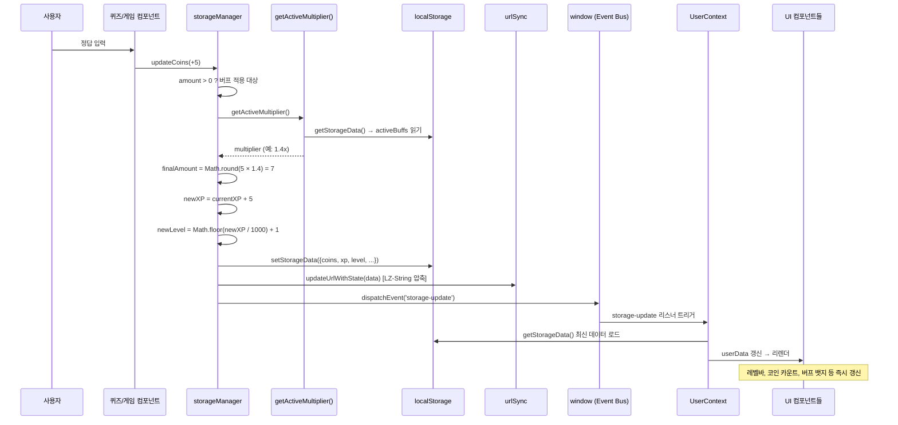
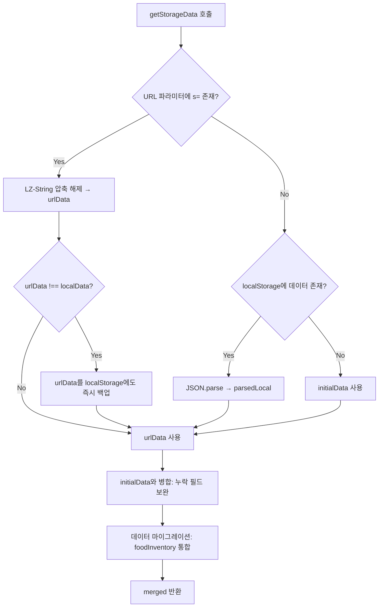
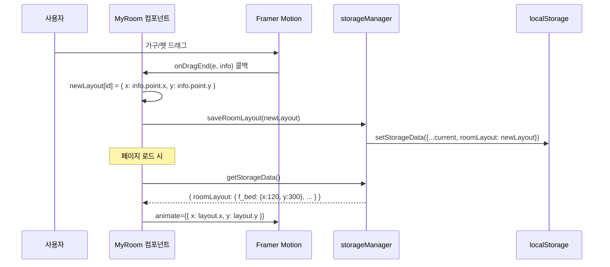
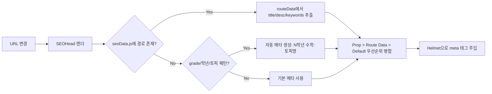
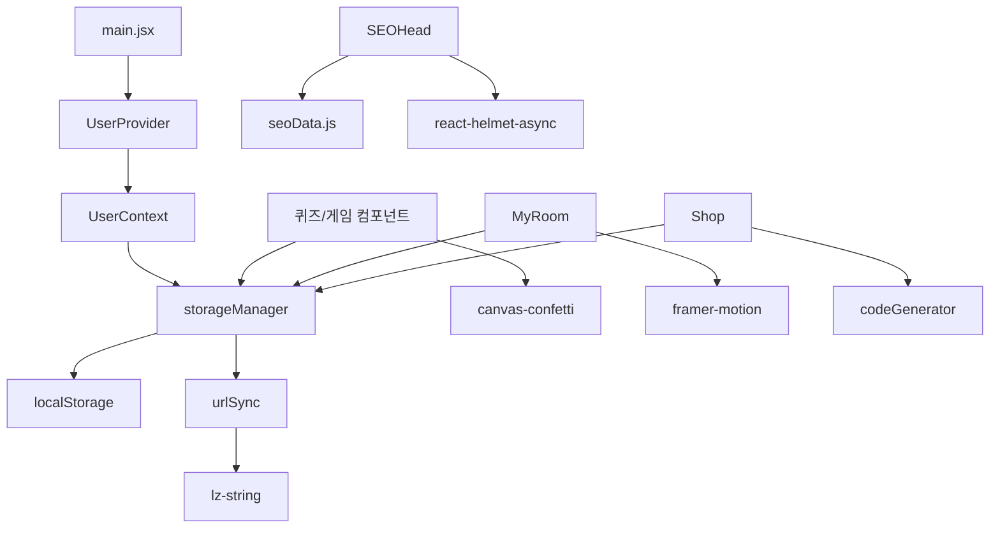

# ⚙️ CORE_LOGIC (핵심 비즈니스 로직 - Deep Dive)

> 최종 갱신: 2026-05-04 | 대상 코드: `src/utils/storage/`, `src/context/`, `src/pages/`, `scripts/`, `src/components/math/`

---

## 0. 아키텍처 개요

매쓰 펫토리는 **localStorage를 Source of Truth로 삼는 이벤트 기반 단방향 데이터 흐름** 아키텍처를 채택하고 있다. React Context(UserContext)는 localStorage의 읽기 전용 캐시 역할을 하며, 상태 변경은 항상 `storageManager`를 거쳐 localStorage에 먼저 기록된 후 커스텀 이벤트로 UI에 전파된다.

```
[사용자 조작] → [컴포넌트] → [storageManager 쓰기] → [localStorage + URL 동기화]
                                                       ↓ dispatchEvent('storage-update')
                                                 [UserContext / 개별 컴포넌트 리렌더]
```

### 핵심 파일 맵
| 파일 | 역할 |
|---|---|
| `src/utils/storage/storageManager.js` | 모든 상태의 CRUD + 버프/코인/XP 계산 (비즈니스 로직의 핵심) |
| `src/utils/storage/urlSync.js` | LZ-String 압축으로 URL 파라미터에 상태 직렬화/복원 |
| `src/utils/storage/codeGenerator.js` | Base64 기반 백업 코드 생성/파싱 (MATH- 접두사) |
| `src/context/UserContext.jsx` | `storage-update` 이벤트 수신 → 전역 userData 갱신 |
| `src/data/seoData.js` | SEO 메타데이터의 Source of Truth (66KB, 전 라우트 커버) |

---

## 1. 학습 보상 파이프라인 (The Reward Loop)

### 1-1. 설계 의도
문제 풀이 → 코인 획득 → 상점 소비 → 펫 케어 → 버프 획득 → 보상 증폭의 **폐루프(Closed Loop)** 를 구성하여, 학습 행위와 펫 케어 행위가 상호 증폭되도록 설계했다. 단순한 포인트 적립이 아닌 **시간 제한 버프**를 도입하여 '지금 펫에게 먹이를 주면 당장 다음 문제에서 보너스'라는 즉각적 피드백 루프를 만든다.

### 1-2. 데이터 흐름 (정답 입력 → UI 갱신까지의 전 과정)

1. **정답 제출**: 사용자가 퀴즈/게임 컴포넌트에서 정답 입력
2. **코인 계산**: 컴포넌트가 `updateCoins(amount)` 호출 (예: `MathQuiz`는 정답 시 +5, 10문제 마일스톤 시 +50)
3. **버프 승수 적용**: `updateCoins` 내부에서 `getActiveMultiplier()` 호출
   - `amount > 0`일 때만 승수 적용 (구매 시 버프 적용 안 함 → 경제 밸런스 보존)
   - 승수 = `Math.min(2.0, 1.0 + activeBuffCount × 0.2)`
4. **XP 적립**: `Math.abs(amount)` 만큼 XP 누적 (오답 시 XP 차감 없음, 항상 양수 누적)
5. **레벨 계산**: `Math.floor(newXP / 1000) + 1` (1,000 XP당 1레벨 상승)
6. **저장소 쓰기**: `setStorageData(newData)` → localStorage + URL 동기화
7. **이벤트 발생**: `window.dispatchEvent(new Event('storage-update'))`
8. **UI 동기화**: `UserContext` 및 개별 페이지의 `useEffect` 리스너가 `getStorageData()` 재호출 → 리렌더

### 1-3. 보상 체계 상세

| 소스 | 기본 코인 | 버프 적용 | XP | 비고 |
|---|---|---|---|---|
| MathQuiz 정답 | +5 | ✅ | +5 | 10문제 마일스톤 시 +50 |
| MathGame 점수 | score × 1 | ✅ | score | 60초 레이스, 콤보 5+ 시 문제당 20점 |
| WordProblemQuiz | +10 | ✅ | +10 | 문장제 정답 |
| 상점 구매 | -price | ❌ | +0 | 버프 미적용 (이득이 아니므로) |
| 간식 구매 | -50 | ❌ | +0 | MyRoom에서 1개당 50코인 |

### 1-4. 시퀀스 다이어그램 (정답 → 보상 → UI 갱신)



---

## 2. 상태 영속화 3계층 아키텍처 (State Persistence Triad)

### 2-1. 설계 의도
초등학생 사용자 환경에서는 기기 변경, 브라우저 초기화, 실수로 탭 닫기 등의 상황이 빈번하다. 이를 대비하여 **3계층 영속화** 전략을 취한다:
1. **localStorage**: 1차 저장소. 즉시 읽고 쓰는 Source of Truth.
2. **URL 파라미터**: 2차 저장소. 공유/복원 목적. `?s=<LZ-String 압축값>`.
3. **백업 코드**: 3차 저장소. Base64 인코딩 + `MATH-` 접두사. 부모님이 메모해 두는 용도.

### 2-2. getStorageData()의 3-티어 읽기 우선순위



**핵심**: URL 데이터가 있으면 localStorage보다 우선한다. 이는 "공유 링크로 접속한 사용자가 링크 작성자의 상태를 정확히 복원해야 한다"는 요구사항 때문이다. URL 데이터가 localStorage와 다르면 localStorage에도 즉시 동기화하여, 이후 새로고침 시에도 상태가 유지되도록 한다.

### 2-3. urlSync.js 상세

| 함수 | 동작 |
|---|---|
| `encodeState(state)` | `JSON.stringify` → `LZString.compressToEncodedURIComponent` |
| `decodeState(encoded)` | `LZString.decompressFromEncodedURIComponent` → `JSON.parse` |
| `getStateFromUrl()` | `URLSearchParams.get('s')` → `decodeState` |
| `updateUrlWithState(state)` | `encodeState` → `url.searchParams.set('s', ...)` → `history.replaceState` |

**`replaceState`를 사용하는 이유**: `pushState`를 쓰면 매 상태 변경마다 브라우저 히스토리에 항목이 쌓여 뒤로 가기 버튼이 비정상적으로 동작한다. `replaceState`는 현재 히스토리 항목만 교체하므로 내비게이션이 깔끔하게 유지된다.

### 2-4. codeGenerator.js 상세

| 함수 | 동작 |
|---|---|
| `generateSaveCode(data)` | `JSON.stringify` → `btoa(unescape(encodeURIComponent(...)))` → `MATH-` 접두사 |
| `parseSaveCode(code)` | `MATH-` 제거 → `decodeURIComponent(escape(atob(...)))` → `JSON.parse` |
| `generateCouponCode(name)` | 이름 Base64 앞 4자리 + 날짜 + 랜덤 4자리 → `C-XXXX-...` |

**`unescape(encodeURIComponent(...))` 트릭**: `btoa()`는 Latin-1 문자만 처리한다. 한글 등 유니코드가 포함된 JSON을 안전하게 Base64 인코딩하기 위해, 먼저 `encodeURIComponent`로 UTF-8 바이트 시퀀스로 변환한 뒤 `unescape`로 Latin-1 문자열로 되돌리는 정통 테크닉을 사용한다.

---

## 3. 펫 버프 시스템 (Pet Buff System)

### 3-1. 설계 의도
펫에게 간식을 주는 행위가 학습 보상으로 직결되도록 설계하여, **"펫 케어 = 학습 인센티브"** 라는 핵심 게임화 루프를 완성한다. 버프에 시간 제한(30분)을 둠으로써:
- 학습 세션 직전에 간식을 주도록 유도 (시간 압박감)
- 무한 버프 누적을 방지 (밸런스 유지)
- 여러 펫을 키울수록 버프 슬롯이 늘어나는 메타 동기 부여

### 3-2. 핵심 알고리즘

```
feedPet(petId):
  1. snack 재고 확인 → 0이면 false 반환
  2. activeBuffs[petId] = Date.now() + 30×60×1000 (30분 후 만료 타임스탬프)
  3. snack -= 1
  4. setStorageData(갱신된 데이터)

getActiveMultiplier():
  1. activeBuffs의 모든 만료 시간 중 now보다 큰 것 카운트 → activeBuffCount
  2. return Math.min(2.0, 1.0 + activeBuffCount × 0.2)
```

**버프 승수표**:
| 활성 펫 수 | 승수 |
|---|---|
| 0 | 1.0x |
| 1 | 1.2x |
| 2 | 1.4x |
| 3 | 1.6x |
| 4 | 1.8x |
| 5+ | 2.0x (상한선) |

### 3-3. 만료 처리 전략
별도의 타이머나 클린업 로직이 없다. 대신 **지연 평가(Lazy Evaluation)** 방식을 채택하여, `getActiveMultiplier()`가 호출될 때마다 그 시점의 `Date.now()`와 비교하여 만료 여부를 실시간 판단한다. 이 방식의 장점:
- 백그라운드 타이머 리소스 불필요
- 기기 시간 변경에도 논리적 일관성 유지
- 만료된 버프 엔트리가 localStorage에 잔류하더라도 계산에 영향 없음

MyRoom 컴포넌트는 `setInterval(() => setNow(Date.now()), 1000)` 로 1초마다 리렌더하여 버프 타이머 카운트다운을 실시간 표시한다.

---

## 4. 펫 마이룸 가구 배치 시스템 (Layout Persistence)

### 4-1. 데이터 흐름



### 4-2. 좌표 저장 방식
- `roomLayout` 객체: `{ itemId: { x, y } }` 형태
- itemId는 가구 ID(`f_bed`, `f_desk` 등) 또는 펫 ID(`hamster`, `cat_siamese` 등)
- Framer Motion의 `onDragEnd`에서 `info.point.x/y`를 캡처
- 펫의 기본 위치는 인덱스 기반 프리셋 배열로 제공: `[-300, 300, -150, 150, ...]`

### 4-3. 편집 모드 토글
`isEditMode` 상태로 드래그 활성화/비활성화를 제어한다. 편집 모드가 아닐 때는 펫 클릭이 대화 이벤트를 트리거하고, 편집 모드일 때는 드래그만 허용하며 클릭 이벤트를 무시한다.

---

## 5. 문제 생성 엔진 (Problem Generation Engine)

### 5-1. MathQuiz (src/components/math/MathQuiz.jsx)
학년 공통 퀴즈. 8개 토픽(addition, subtraction, multiplication, division, fraction, length, time, circle)을 제공하며, 각 토픽별로 난이도가 학년에 관계없이 고정되어 있다. 3학년 수준의 문제가 기본이다.

**마일스톤 보상**: `problemsSolved % 10 === 0`일 때마다 +50 보너스 코인을 지급하고 축하 모달을 표시한다.

### 5-2. MathGame (src/pages/MathGame.jsx)
60초 타임어택 레이스 게임. 학년에 따라 문제 난이도가 자동 조정된다:

| 학년 | 연산 범위 |
|---|---|
| 1 | 20 이하 덧셈/뺄셈 (규칙/그래프 보너스 구현됨) |
| 2 | 두 자리 수 덧셈/뺄셈 또는 구구단 2~5단 (수열 규칙/데이터 해석 구현됨) |
| 3 | 구구단 전체 + 나눗셈 |
| 4 | 큰 수 곱셈/나눗셈 |
| 5-6 | 심화 곱셈/나눗셈 |

**콤보 시스템**: 5연속 정답 시 FEVER 모드 진입, 문제당 20점(기본 10점). 오답 시 콤보 리셋.

**보상 계산**: 게임 종료 시 `Math.floor(score × getActiveMultiplier())` 코인 지급.

### 5-3. wordProblemGenerator (src/utils/math/wordProblemGenerator.js)
문장제 자동 생성 엔진. **하이브리드 아키텍처**로 구현되어 있다:
- **3학년**: 템플릿 기반 엔진 (새로운 아키텍처, 60개 템플릿)
- **그 외 학년**: 레거시 하드코딩 로직 (기존 방식)

#### 템플릿 기반 아키텍처 (3학년 전용, 2026-05-04 리팩터링)

**파일 구조**:
```
src/data/wordProblems/
├── grade3.js                        # 메인 파일 (60개 템플릿 통합)
├── grade3-addition-subtraction.js   # 덧셈/뺄셈 (17개)
├── grade3-multiplication-division.js # 곱셈/나눗셈 (14개)
├── grade3-time-length-weight.js     # 시간/길이/무게 (12개)
├── grade3-fraction-shape.js         # 분수/도형 (8개)
├── grade3-logic-card.js             # 사고력/규칙/카드 (8개)
└── commonContexts.js                # 공통 컨텍스트 (이름, 물건, 상황)
```

**템플릿 구조**:
```javascript
{
  id: 'g3-addition-basic',
  grade: 3,
  unit: 'addition-subtraction',
  difficulty: 'basic',
  tags: ['addition', 'three-digit'],
  skill: '세 자리 수 덧셈',
  generate: ({ rand, NAMES, ITEMS, ...context }) => {
    // 문제 생성 로직
    return { q, ans, exp, hint, equation, answerType };
  }
}
```

**Context 객체**: 템플릿 generate 함수에 전달되는 유틸리티와 데이터
- `rand.int(min, max)`: 난수 생성
- `rand.pick(arr)`: 배열에서 랜덤 선택
- `rand.shuffle(arr)`: 배열 섞기
- `NAMES`, `ITEMS`: 공통 어휘
- `ADDITION_CONTEXTS`, `SUBTRACTION_CONTEXTS`: 상황별 어휘

**난이도 필터링**: `difficulty` 파라미터로 `'basic'`, `'advanced'`, `'mixed'` 선택 가능. 템플릿의 `difficulty` 필드와 일치하는 것만 필터링하여 선택한다.

**폴백 메커니즘**: 템플릿 로드 실패 시 레거시 코드로 자동 전환 (안전성 보장).

**검증 스크립트**: `validate-word-problems.js`로 모든 템플릿의 구조와 실행 가능성을 자동 검증 (59개 템플릿 100% 통과).

#### 레거시 아키텍처 (그 외 학년)

| 학년 | 기본 유형 | 심화 유형 |
|---|---|---|
| 1 | 덧셈 총합, 뺄셈 잔여, 비교, 순서 | 조건 수 찾기, 순서 논리, 역계산, 비교 논리, 도형 논리 |
| 2 | 두 자리 연산, 길이, 시간 | (확장 가능) |
| 4-6 | 학년별 다양한 연산/개념 조합 | 사고력 중심 심화 문제 |

---

## 6. SEO 자동화 및 실시간 인덱싱 (SEO Automation)

### 6-1. 런타임 SEO: SEOHead 컴포넌트



**3단계 우선순위**: 컴포넌트 Prop → seoData.js 라우트 매칭 → 기본값. 이 계층화 덕분에 새 페이지를 추가할 때 seoData.js만 업데이트하면 되고, 특정 페이지에서 Prop으로 오버라이드도 가능하다.

### 6-2. 빌드타임 SEO 파이프라인

```
npm run build
  → node scripts/generate-seo.js
      → seoData.js 읽기
      → dist/sitemap.xml 생성
      → dist/rss.xml 생성
      → dist/robots.txt 생성
      → IndexNow Streaming 전송 (URL별 GET, 200ms 간격)
  → node scripts/google-indexing.js
      → google-indexing-key.json 로드
      → Google Indexing API 호출 (일일 200회 한계)
  → vite build
  → node scripts/post-build.js
```

### 6-3. IndexNow Streaming Mode 설계 의사결정
Bing의 IndexNow API는 배치(POST)와 스트리밍(GET) 두 가지 방식을 지원한다. 매쓰 펫토리는 스트리밍 방식을 선택했는데, 그 이유는:
- **부분 성공 처리**: 배치 방식에서 하나의 URL이 거부되면 전체가 실패할 위험이 있으나, 스트리밍은 각 URL이 독립적으로 처리됨
- **Rate Limit 방지**: 200ms 간격으로 서버 부하를 분산
- **디버깅 용이**: 개별 URL의 성공/실패를 로그로 추적 가능

---

## 7. 예외 처리 및 데이터 마이그레이션 전략

### 7-1. foodInventory 마이그레이션
초기 버전에서는 `foodInventory`가 `{ apple: 3, fish: 2 }` 등 다중 항목이었다. 현재는 `{ snack: N }` 단일 항목으로 통합되었다. `getStorageData()`는 이 마이그레이션을 자동 수행한다:

```javascript
if (merged.foodInventory && !merged.foodInventory.snack) {
    const total = Object.values(merged.foodInventory)
        .reduce((a, b) => a + (typeof b === 'number' ? b : 0), 0);
    merged.foodInventory = { snack: total };
}
```

이 로직은 `snack` 키가 없는 구버전 데이터를 감지하여, 모든 식료 항목의 값을 합산해 `snack` 하나로 병합한다. `typeof b === 'number'` 체크는 변형된 데이터(문자열, undefined 등)에 대한 방어 코드다.

### 7-2. 초기 데이터 보완 (Schema Migration)
`{ ...initialData, ...sourceData }` 병합은 새 필드가 추가될 때 구버전 데이터에 자동으로 기본값이 채워지도록 보장한다. 예를 들어 `badges` 필드가 없는 구버전 저장소는 `initialData.badges = []` 로 자동 보완된다.

### 7-3. 에러 복구
`getStorageData()`와 `setStorageData()` 모두 try-catch로 감싸져 있다:
- 읽기 실패 시 → `initialData` 반환 (안전한 폴백)
- 쓰기 실패 시 → `console.error` 출력 후 조용히 무시 (앱 크래시 방지)

### 7-4. Google Indexing API 할당량 방어
`scripts/google-indexing.js`는 Google Indexing API의 일일 할당량(200회)을 초과하면 자동으로 요청을 중단하는 방어 로직이 포함되어 있다.

---

## 8. 의존성 관계 맵

### 8-1. 내부 의존성 (런타임)



### 8-2. 외부 의존성 (빌드타임)
| 스크립트 | 의존 | 용도 |
|---|---|---|
| `generate-seo.js` | `seoData.js`, Node 내장 | sitemap/rss/robots/IndexNow |
| `google-indexing.js` | `googleapis`, `google-indexing-key.json` | Google Indexing API |
| `post-build.js` | Node 내장 | 빌드 후처리 |

### 8-3. 핵심 npm 패키지
| 패키지 | 역할 | 사용 컴포넌트 |
|---|---|---|
| `react-router-dom` | SPA 라우팅 | App.jsx (60+ 라우트) |
| `framer-motion` | 드래그/애니메이션 | MyRoom, 퀴즈 피드백 |
| `canvas-confetti` | 정답 축하 이펙트 | MathQuiz, MathGame, Shop |
| `lz-string` | URL 상태 압축 | urlSync |
| `react-helmet-async` | 동적 메타 태그 | SEOHead, JsonLd |
| `recharts` | 학습 데이터 차트 | ParentPage |
| `@react-three/fiber` | 3D 렌더링 | GeometryExplorer 등 |
| `lucide-react` | 아이콘 | 전역 (Timer, Star 등) |

---

## 9. 지식 전수: 기술적 난도가 높은 부분 상세 풀이

### 9-1. [난도: 높음] 이벤트 버스 기반 상태 동기화의 트레이드오프

매쓰 펫토리는 React의 표준적인 상태 관리(Redux, Zustand 등) 대신 **`window.dispatchEvent` + 커스텀 이벤트** 방식을 사용한다. 이 선택의 이유와 트레이드오프:

**이유**: `storageManager`가 비동기 없이 동기적으로 localStorage를 조작하므로, 상태 변경이 즉시 확정된다. React Context만으로는 다른 Context나 이벤트 리스너 없이 직접 상태를 읽는 컴포넌트(예: HomePage가 `getStorageData()`를 직접 호출)와의 동기화가 깨진다. 커스텀 이벤트는 이 "격리된 리스너"들에게도 브로드캐스트할 수 있다.

**트레이드오프**:
- ✅ 간단한 구현, 외부 라이브러리 불필요
- ✅ localStorage를 Source of Truth로 일관성 보장
- ⚠️ 이벤트가 동기적이므로 대량의 리스너가 있을 때 성능 병목 가능
- ⚠️ `storage-update` 이벤트명이 문자열이라 타이핑 오류에 취약 (TypeScript 도입 시 해결 가능)
- ⚠️ React의 렌더링 사이클 밖에서 발생하는 이벤트이므로, `useEffect` 내에서 수동 구독/구독 해제 필요

### 9-2. [난도: 중간] URL 동기화와 브라우저 히스토리의 관계

`updateUrlWithState`는 `history.replaceState`를 사용한다. 이는 현재 히스토리 엔트리를 교체하는 API로, 뒤로 가기 시 이전 상태로 돌아가지 않는다. 만약 `pushState`를 사용했다면, 문제를 풀 때마다 히스토리에 항목이 쌓여 사용자가 10문제를 푼 후 뒤로 가기를 10번 눌러야 원래 페이지로 돌아갈 수 있었을 것이다.

**주의점**: `replaceState`는 브라우저의 세션 히스토리 스택을 수정하지 않으므로, `popstate` 이벤트가 발생하지 않는다. 즉 URL이 변경되어도 React Router는 이를 네비게이션으로 인식하지 않는다. 이는 의도된 동작이다 (상태 동기화가 네비게이션이 아니므로).

### 9-3. [난도: 중간] updateCoins의 비대칭 버프 적용

```javascript
if (amount > 0) {
    const multiplier = getActiveMultiplier();
    finalAmount = Math.round(amount * multiplier);
}
```

`amount > 0` 조건은 **이득을 볼 때만 버프를 적용**한다는 핵심 설계 결정이다. 상점에서 코인을 소비할 때는 `updateCoins(-price)`가 호출되는데, 여기에 버프가 적용되면 (승수가 1.4라면 -price × 1.4 = 더 많은 코인 소비) 경제 밸런스가 붕괴된다. 반대로 음수에 버프를 곱하면 소비가 줄어드는 버그도 발생할 수 있다. 따라서 양수(보상)에만 승수를 적용하는 것이 유일한 안전한 설계다.

### 9-4. [난도: 낮음] initialData 병합으로 인한 스키마 진화 대응

```javascript
const merged = { ...initialData, ...sourceData };
```

이 간단한 한 줄이 스키마 진화를 가능하게 한다. 새 필드가 추가되면 `initialData`에 기본값을 정의하기만 하면, 구버전 저장소 데이터에는 자동으로 그 기본값이 채워진다. `...sourceData`가 뒤에 오므로 기존 필드는 사용자 데이터가 우선하고, 새 필드는 `initialData`의 기본값이 사용된다.

**한계**: 필드 이름 변경이나 필드 삭제는 자동 처리되지 않는다. 예를 들어 `foodInventory.apple` → `foodInventory.snack` 변경은 명시적 마이그레이션 코드가 필요했다 (7-1절 참조). 향후 복잡한 마이그레이션이 필요해지면 버전 필드(`schemaVersion`)를 도입하여 단계적 마이그레이션을 구현하는 것을 권장한다.

### 9-5. [난도: 낮음] 의존성 충돌 및 빌드 안정화 (.npmrc)

React 19 마이그레이션 과정에서 `@react-three/drei` 등 일부 라이브러리의 엄격한 peer dependency 요구사항으로 인해 Vercel 빌드 에러가 발생할 수 있다. 이를 위해 `.npmrc` 파일에 `legacy-peer-deps=true` 설정을 추가하여 빌드 시점의 의존성 해석 충돌을 방지한다. 이는 최신 라이브러리 도입과 레거시 환경 간의 가교 역할을 한다.

---

## 10. 데일리 퀘스트 엔진 (Daily Quest Engine)

### 10-1. 설계 의도
학습 행위를 일회성이 아닌 **습관(Habit)**으로 만들기 위한 리텐션 장치이다. 자정(Midnight)을 기준으로 초기화되는 퀘스트 세트를 통해 매일 새로운 성취감을 제공하고, 연속 출석(Streak) 시스템으로 매몰 비용(Sunk Cost)을 창출한다.

### 10-2. 핵심 로직: 지연 초기화 (Lazy Reset)
매번 데이터를 읽을 때마다 초기화 로직을 돌리는 대신, 앱의 진입점(`HomePage`) 마운트 시 단 한 번 `checkDailyReset()`을 호출하여 초기화 여부를 판단한다.

```javascript
checkDailyReset():
  1. lastLoginDate (YYYY-MM-DD) 읽기
  2. 현재 날짜(KST 기준)와 비교
  3. 날짜가 다르면:
     - Streak 계산: (오늘 - lastLoginDate) === 1일 이면 streak++
     - dailyQuests 객체 초기화 (all false)
     - lastLoginDate를 오늘로 갱신
  4. 상태 저장 및 storage-update 이벤트 전송
```

### 10-3. 퀘스트 트리거 시스템
퀘스트는 명시적으로 '완료 버튼'을 누르는 방식과 특정 행위 시 '자동 트리거'되는 방식이 혼합되어 있다.
- **자동 트리거**: `feedPet()` 호출 시 `feedPet` 퀘스트 완료, `updateLastLearned()` 호출 시 `study` 퀘스트 완료.
- **수동 트리거**: `attendance` 퀘스트는 메인 페이지 위젯에서 '받기' 버튼 클릭 시 확정.

---

## 11. 광고 수익화 전략 (Monetization Strategy)

### 11-1. 설계 의도: 학부모 타겟팅 (Parental Targeting)
아이들의 학습 경험(UX)을 해치지 않으면서 수익을 창출하기 위해 **"유료 전환의 주체인 학부모가 머무는 공간"**에만 제한적으로 광고를 노출한다.

### 11-2. 광고 노출 영역 (Ad Surface)
- `/parent`: 학습 데이터 리포트 하단
- `/grade/*/worksheet`: 학습지 출력 설정 화면 하단 (출력물 자체에는 포함되지 않음)

### 11-3. 기술적 구현: ParentAdBanner
- **컴포넌트화**: `ParentAdBanner.jsx`로 모듈화하여 필요한 곳에 즉시 삽입 가능.
- **프린트 방어**: CSS Media Query(`@media print { .noPrint { display: none; } }`)를 활용하여 학습지 출력 시에는 광고가 포함되지 않도록 보장한다.
- **확장성**: 현재는 플레이스홀더 형태이나, Google AdSense 승인 후 `ins` 태그만 삽입하면 즉시 활성화된다.

