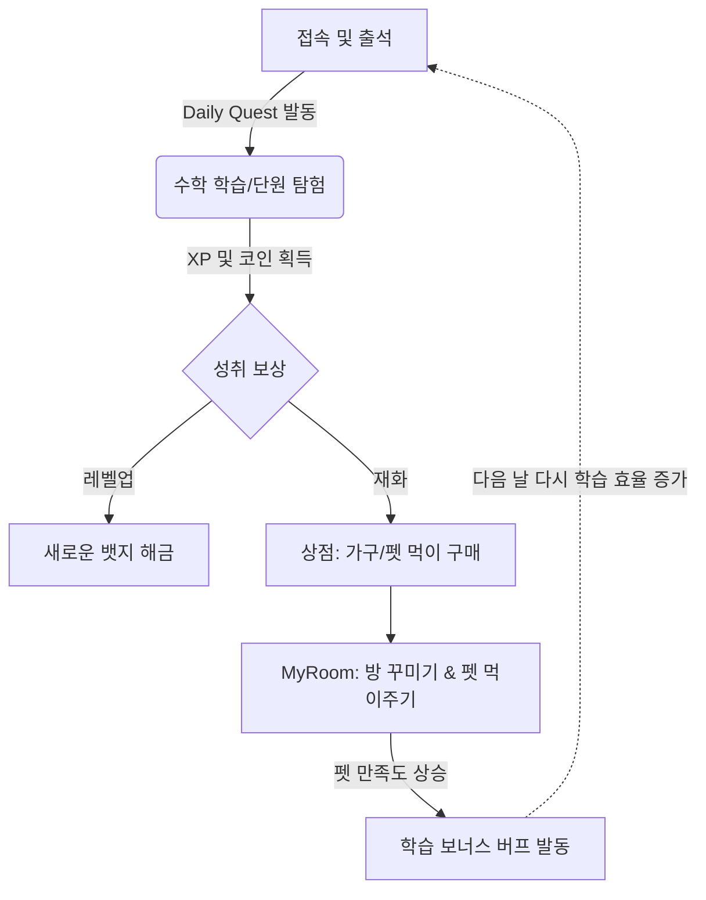

# 🗺️ STRATEGY_MAP (전략 지도 및 사용자 흐름)

## 🔄 사용자 흐름 (User Flow & Gamification Loop)

매쓰 펫토리의 핵심 전략은 '학습'과 '보상'이 무한 반복되는 플라이휠(Flywheel)을 만드는 것입니다.

## 🧩 개념적 모듈 관계 (Conceptual Architecture)

향후 도입될 수익화(BM) 및 클라우드 아키텍처를 대비한 모듈 구조입니다.

| 계층 (Layer) | 현재 구현 (As-Is) | 미래 확장 (To-Be) | 설명 |
| :--- | :--- | :--- | :--- |
| **Presentation** | React 19 SPA, Glassmorphism UI | PWA (웹앱 설치 지원) | 디바이스 종속성 완화 및 네이티브 앱 경험 제공 |
| **Gamification** | Local Rules (XP, Coin, Buffs) | Daily Quests & Streaks | 리텐션(재방문율)을 높이기 위한 매일 접속 유도 장치 |
| **Monetization** | N/A (100% Free) | Parent Ads & Premium Sub | 학부모 화면 제한적 광고 노출 및 클라우드 동기화 월구독 |
| **Data / State** | `localStorage` + URL Sync | `Supabase` (BaaS) DB Sync | 프리미엄 유저 대상 멀티 디바이스 동기화 (Data Lock-in) |

## 🚀 비즈니스 단계별 목표 (Milestones)
- **Phase 0 (완료)**: 유치~초등 전 과정(1~6학년)의 핵심 수학 개념 시각화 및 로컬 게임화 엔진 완성.
- **Phase 1 (예정)**: **리텐션 방어 시스템 구축**. 일일 퀘스트 도입 및 학부모 리포트 고도화 (광고 수익화 테스트).
- **Phase 2 (중기)**: **프리미엄 전환**. 클라우드 DB 연동 및 결제 모듈(Stripe/PortOne) 연동을 통한 구독 생태계 구축.
