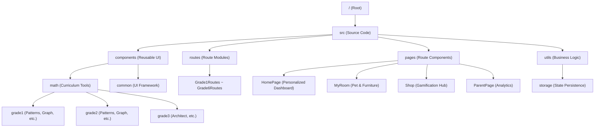

# 🗺️ SYSTEM_MAP (프로젝트 구조 지도)

## 🏗️ 서비스 개요
- **서비스명**: 매쓰 펫토리 (Math Petory)
- **목적**: 초등 수학 원리 학습 및 펫 키우기 게임화(Gamification) 플랫폼
- **도메인**: [https://math.lego-sia.com](https://math.lego-sia.com)

## 🛠️ 기술 스택
| 구분 | 기술 |
| :--- | :--- |
| **Framework** | React 19 (Vite 7) |
| **Styling** | Vanilla CSS (CSS Modules) |
| **Animation** | Framer Motion, canvas-confetti |
| **Visuals** | Three.js (@react-three/fiber), Recharts |
| **Icons** | Lucide React |
| **Deployment** | Vercel |
| **SEO** | custom scripts (Sitemap, RSS, IndexNow, Google Indexing) |

## 📁 디렉토리 구조 (핵심)

### 1. `src/` (주요 로직)
- `App.jsx`: 메인 라우터 (React.lazy & Suspense 기반, ErrorBoundary 적용)
- `routes/Grade1Routes.jsx ~ Grade6Routes.jsx`: 학년별 라우팅 모듈화
- `pages/HomePage.jsx`: 펫 위젯, 학습 이어하기, 레벨, 뱃지를 담은 개인화 대시보드
- `pages/MyRoom.jsx`: 가구 배치 시스템 및 펫 인터랙션 구현
- `pages/ParentPage.jsx`: Recharts 기반의 학습 데이터 시각화 리포트
- `utils/storage/storageManager.js`: XP, 코인, lastLearned 등 모든 상태의 영속성 관리 (URL Sync 포함)
- `hooks/useTrackProgress.js`: 페이지 방문 시 자동으로 마지막 학습 위치를 기록하는 훅
- `components/math/grade1/Patterns1st.jsx`: 1학년 규칙 찾기 (ABAB, AAB, ABC 패턴)
- `components/math/grade1/Graph1st.jsx`: 1학년 표와 그래프 (과일 세기 및 막대그래프)
- `components/math/grade2/Patterns2nd.jsx`: 2학년 규칙 찾기 (수열 및 도형 회전)
- `components/math/grade2/Graph2nd.jsx`: 2학년 표와 그래프 (데이터 해석 퀴즈 포함)
- `utils/math/wordProblemGenerator.js`: 문장제 자동 생성 엔진 (3학년은 템플릿 기반, 그 외는 레거시 로직)
- `utils/math/wordProblemEngine.js`: 템플릿 기반 문제 생성 엔진 (새로운 아키텍처)
- `utils/math/problemUtils.js`: 문제 생성 공통 유틸리티 (rand, format, math, answer, text)
- `data/wordProblems/grade3.js`: 3학년 문제 템플릿 메인 파일 (60개 템플릿 통합)
- `data/wordProblems/grade3-addition-subtraction.js`: 3학년 덧셈/뺄셈 템플릿 (17개)
- `data/wordProblems/grade3-multiplication-division.js`: 3학년 곱셈/나눗셈 템플릿 (14개)
- `data/wordProblems/grade3-time-length-weight.js`: 3학년 시간/길이/무게 템플릿 (12개)
- `data/wordProblems/grade3-fraction-shape.js`: 3학년 분수/도형 템플릿 (8개)
- `data/wordProblems/grade3-logic-card.js`: 3학년 사고력/규칙/카드 템플릿 (8개)
- `data/wordProblems/commonContexts.js`: 문제 생성용 공통 컨텍스트 (이름, 물건, 상황 등)

### 2. `scripts/` (자동화)
- `generate-seo.js`: 빌드 시 `sitemap.xml`, `rss.xml`, `robots.txt`를 자동 생성하고 IndexNow에 Streaming 방식으로 제출함.
- `google-indexing.js`: Google Indexing API를 통해 실시간 색인 요청을 보냄.
- `update-seo-descriptions.js`: 대규모 SEO 메타데이터 업데이트 스크립트.

## 🔗 외부 연동 정보
- **IndexNow Key (Bing)**: `bbd0d9a6843c450eb3e9d811a0fd504a`
- **IndexNow Key (Naver)**: `7c007da9c90cef3f9485956806191b31`
- **Indexing API**: Google Indexing API, Bing IndexNow, Naver Search Advisor
- **Google Service Account**: `google-indexing-bot@lego-sia-index.iam.gserviceaccount.com`

## 🛡️ 가동 원칙
1. 모든 페이지 추가 시 `src/data/seoData.js`에 먼저 등록할 것.
2. 빌드 전 `npm run index` 또는 `npm run build`를 통해 SEO 정보를 갱신할 것.
3. `index.html`은 최소한의 셸 구조만 유지하며, 정적인 메타 설명(Description) 태그를 직접 삽입하지 말 것 (SEOHead 컴포넌트와 충돌 방지).
